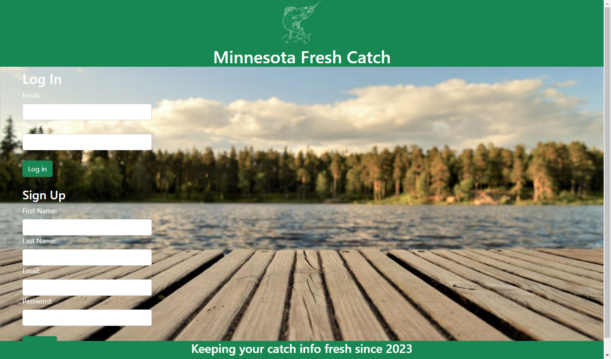

# Minnesota Fresh Catch

## Description
Welcome to our repository for group project 2! We have created a web application that utilizes a database to track fish caught in minneapolis lakes. Users who create a profile can log their catch species, length, locations, and date. A brand new user needs to use the sign up form to create an account. The sign up form requires a first name, last name, email, and password. Returning users do not need to create a profile. They can simply fill in the login form with the email and password they used to sign up. After logging in or signing up, users are redirected to their profile. At the profile page, users can register a newly caught fish and view previously caught fish. A bar graph depicts the number of catches at the bottom of the profile page. The application has a database called freshcatch. This database consists of three tables: Catch, Fish, and User.

## Screenshots

## Link to the Deployed Application
Open [https://minnesota-fresh-catch.herokuapp.com/](https://minnesota-fresh-catch.herokuapp.com/) with your browser to see the result.

## Creators
Zach Gilbert, Jason Triemert, Noah Dockman, Safia Mustaf, and Amy Potter
