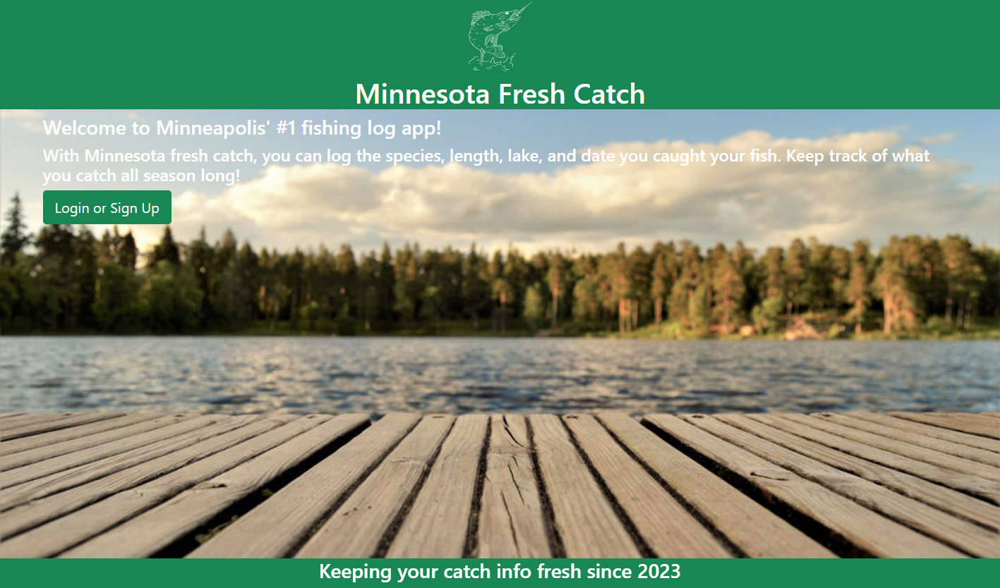
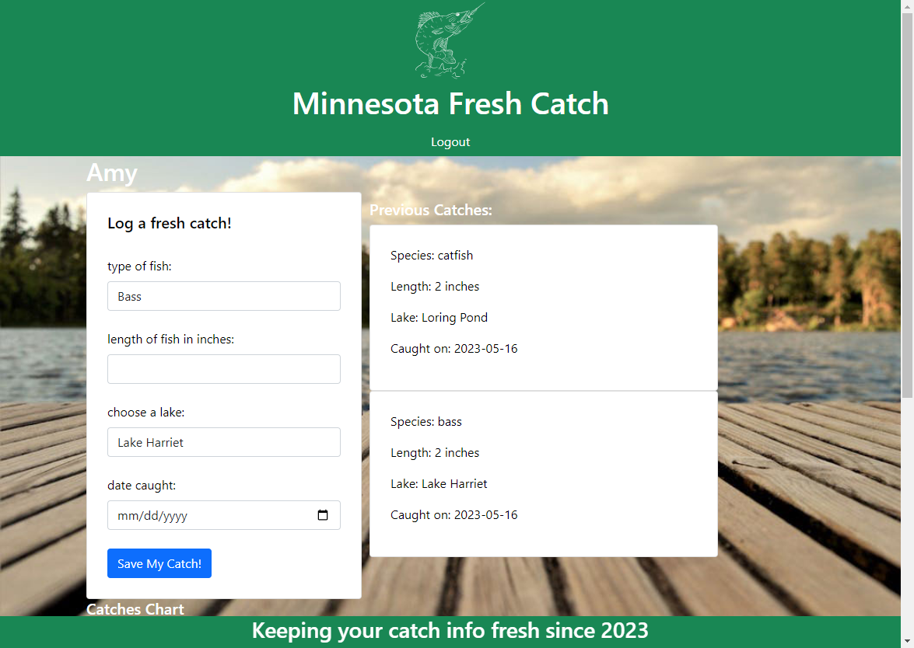
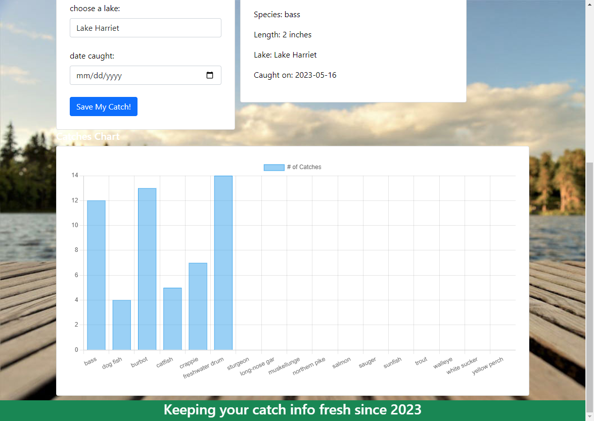

# Minnesota Fresh Catch
## Description
Welcome to our repository for group project 2! We have created a web application that utilizes a database to keep track users fish caught in minneapolis lakes. Users who create a profile can log their catch species, length, locations, and date. 
## Screenshots

## Link
Open [https://minnesota-fresh-catch.herokuapp.com/](https://minnesota-fresh-catch.herokuapp.com/) with your browser to see the result.
## Creators
Zach Gilbert, Jason Triemert, Noah Dockman, Safia Mustaf, and Amy Potter
